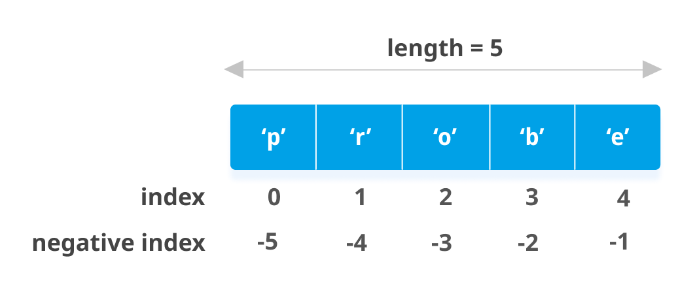

# Python-Cheatsheet

## Basics
Basic syntax from the Python programming language

### Showing Output To User
The `print` function is used to display or print output as follows:

```python
print("Content that you wanna print on screen")
```

We can display the content present in an object using the `print` function as follows:

```python
var1 = "Aarya"
print("Hi my name is: ", var1)
print(f"Hi my name is {var1}") #using f string method
```

### Taking Input From the User
The `input` function is used to take input as a string or character from the user as follows:

```python
var1 = input("Enter your name: ")
print("My name is: ", var1)
```

To take input in the form of other data types we need to typecast them as follows:

To take input as an integer:

```python
var1 = int(input("Enter the integer value: "))
print(var1)
```

To take input as a float:

```python
var1 = float(input("Enter the float value: "))
print(var1)
#similar to int and float we also have char, str etc
```
## Python Data Types
### Numeric Types
- **int**: Integer numbers.
  ```python
  x = 5
  ```

- **float**: Floating-point numbers (decimals).
  ```python
  y = 5.5
  ```

- **complex**: Complex numbers.
  ```python
  z = 1 + 2j
  ```

### Sequence Types

- **str**: String of characters.
  ```python
  name = "Alice"
  ```

- **list**: Ordered, mutable collection.
  ```python
  fruits = ["apple", "banana", "cherry"]
  ```

- **tuple**: Ordered, immutable collection.
  ```python
  point = (10, 20)
  ```

### Mapping Type

- **dict**: Key-value pairs, unordered.
  ```python
  person = {"name": "Alice", "age": 25}
  ```

### Set Types

- **set**: Unordered collection of unique elements.
  ```python
  unique_numbers = {1, 2, 3}
  ```

- **frozenset**: Immutable version of set.
  ```python
  frozen_numbers = frozenset([1, 2, 3])
  ```

### Boolean Type

- **bool**: True or False.
  ```python
  is_active = True
  ```

### None Type

- **NoneType**: Represents the absence of value.
  ```python
  unknown = None
  ```

## range Function
The `range` function returns a sequence of numbers, e.g., numbers starting from 0 to n-1 for `range(0, n)`.

```python
range(int_start_value, int_stop_value, int_step_value)
```

Here the start value and step value are by default 1 if not mentioned by the programmer, but `int_stop_value` is a compulsory parameter in the range function.
also note that `int_start_value`  is inclusive whereas `int_stop_value`  is exclusive

Example - Display all even numbers between 1 to 100:

```python
for i in range(0, 101, 2):
    print(i)
```

### Comments
Comments are used to make the code more understandable for programmers, and they are not executed by the compiler or interpreter.

**Single line comment**

```python
# This is a single line comment
```

**Multi-line comment**

```python
'''This is a
multi-line
comment'''
```

### Escape Sequence
An escape sequence is a sequence of characters; it doesn't represent itself (but is translated into another character) when used inside a string literal or character. Some of the escape sequence characters are as follows:

**Newline Character**:
using newline character we can jump to next line, i.e. the code \n will execute in new line

```python
print("\n")
```

**Backslash**:
It adds a backslash
```python
print("\\")
```

**Single Quote**:
It adds a single quotation mark
```python
print("\'")
```

**Tab**:
It gives a tab space
```python
print("\t")
```

**Backspace**:
It adds a backspace
```python
print("\b")
```

**Octal value**:
It represents the value of an octal number
```python
print("\ooo")
```

**Hex value**:
It represents the value of a hex number
```python
print("\xhh")
```

**Carriage Return**

Carriage return or `\r` will just work as you have shifted your cursor to the beginning of the string or line.

```python
print("\r")
```

## Strings
Python string is a sequence of characters, and each character can be individually accessed using its index.
You can create Strings by enclosing text in both forms of quotes - single quotes or double quotes.

```python
variable_name = "String Data"
```

Example:

```python
str = "Aarya"
print("String is ", str)
```

## Indexing
The position of every character placed in the string starts from 0th position and step by step it ends at length-1 position.


## Python Slicing

Slicing is a technique in Python used to extract a portion of a sequence (like a string, list, or tuple) by specifying a start index, an end index (exclusive), and an optional step size.

### Syntax:

```python
sequence[start:end:step]
```

- **start**: The index where the slice begins (inclusive).
- **end**: The index where the slice ends (exclusive).
- **step** (optional): The increment between characters or elements in the slice.

### Examples:

```python
text = "Hello, World!"

# Extract substring from index 0 to 5 (exclusive).
substring1 = text[0:5]
print(substring1)  # Output: "Hello"

# Omit start index (starts from beginning).
substring2 = text[:5]
print(substring2)  # Output: "Hello"

# Extract substring from index 7 to end of string.
substring3 = text[7:]
print(substring3)  # Output: "World!"

# Negative index to count from end of string.
substring4 = text[-6:]
print(substring4)  # Output: "World!"

# Extract every other character.
substring5 = text[::2]
print(substring5)  # Output: "Hlo ol!"

# Reverse the string.
substring6 = text[::-1]
print(substring6)  # Output: "!dlroW ,olleH"
```

### String Methods
- **isalnum()**: Returns `True` if all the characters in the string are alphanumeric, else `False`.

```python
string_variable.isalnum()
```

- **isalpha()**: Returns `True` if all the characters in the string are alphabets.

```python
string_variable.isalpha()
```

- **isdecimal()**: Returns `True` if all the characters in the string are decimals.

```python
string_variable.isdecimal()
```

- **isdigit()**: Returns `True` if all the characters in the string are digits.

```python
string_variable.isdigit()
```

- **islower()**: Returns `True` if all characters in the string are lower case.

```python
string_variable.islower()
```

- **isspace()**: Returns `True` if all characters in the string are whitespaces.

```python
string_variable.isspace()
```

- **isupper()**: Returns `True` if all characters in the string are upper case.

```python
string_variable.isupper()
```

- **lower()**: Converts a string into lower case equivalent.

```python
string_variable.lower()
```

- **upper()**: Converts a string into upper case equivalent.

```python
string_variable.upper()
```

- **strip()**: It removes leading and trailing spaces in the string.

```python
string_variable.strip()
```

## List
A List in Python represents a list of comma-separated values of any data type between square brackets.

```python
var_name = [element1, element2, ...]
```

These elements can be of different data types.

The position of every element placed in the list starts from 0th position and step by step it ends at length-1 position.

List is ordered, indexed, mutable and the most flexible and dynamic collection of elements in Python.

### List Methods

-**Empty list**: This method allows you to create an empty list.
```python
my_list = []
```

- **index**: Returns the index of the first element with the specified value.

```python
list.index(element)
```

- **append**: Adds an element at the end of the list.

```python
list.append(element)
```

- **extend**: Add the elements of a given list (or any iterable) to the end of the current list.

```python
list.extend(iterable)
```

- **insert**: Adds an element at the specified position.

```python
list.insert(position, element)
```

- **pop**: Removes the element at the specified position and returns it.

```python
list.pop(position)
```

- **remove**: Removes the first occurrence of a given item from the list.

```python
list.remove(element)
```

- **clear**: Removes all the elements from the list.

```python
list.clear()
```

- **count**: Returns the number of elements with the specified value.

```python
list.count(value)
```

- **reverse**: Reverses the order of the list.

```python
list.reverse()
```

- **sort**: Sorts the list.

```python
list.sort(reverse=True|False)
```

## Tuples
Tuples are represented as comma-separated values of any data type within parentheses.

### Tuple Creation
```python
variable_name = (element1, element2, ...)
```

These elements can be of different data types.

The position of every element placed in the tuple starts from 0th position and step by step it ends at length-1 position.

Tuples are ordered, indexed, immutable, and the most secured collection of elements.

### Tuple Methods

Tuples in Python are immutable, meaning their contents cannot be changed after creation. While methods that modify data (like `append()`, `insert()`, `remove()`, `pop()`, `sort()`, `reverse()`) are exclusive to lists, you can safely use other methods with tuples:

- **Querying Methods:**
  - `count(value)`: Returns the number of occurrences of `value`.
  - `index(value)`: Returns the index of the first occurrence of `value`.

- **Utility Methods:**
  - `len()`: Returns the number of items in the tuple.
  - `min()`: Returns the smallest item in the tuple.
  - `max()`: Returns the largest item in the tuple.

- **Iteration and Membership Checking:**
  - Use `for` loops to iterate over tuple elements.
  - Check membership with `in` and `not in`.

### Example:

```python
my_tuple = (1, 2, 3, 2, 4)

# Querying methods
count_twos = my_tuple.count(2)  # Output: 2
index_two = my_tuple.index(2)   # Output: 1

# Utility methods
tuple_length = len(my_tuple)    # Output: 5
min_value = min(my_tuple)       # Output: 1
max_value = max(my_tuple)       # Output: 4

# Iteration and membership checking
for item in my_tuple:
    print(item)

if 3 in my_tuple:
    print("3 is present in the tuple")
else:
    print("3 is not present in the tuple")
```


## Sets
A set is a collection of multiple values which is both unordered and unindexed. It is written in curly brackets.

### Set Creation
Way 1:

```python
var_name = {element1, element2, ...}
```

Way 2:

```python
var_name = set([element1, element2, ...])
```

Set is unordered, immutable, and non-indexed type of collection. Duplicate elements are not allowed in sets.

### Set Methods
- **add**: Adds an element to a set.

```python
set.add(element)
```

- **clear**: Removes all elements from a set.

```python
set.clear()
```

- **discard**: Removes the specified item from the set.

```python
set.discard(value)
```

- **intersection**: Returns intersection of two or more sets.

```python
set.intersection(set1, set2 ... etc)
```

- **issubset**: Checks if a set is a subset of another set.

```python
set.issubset(set)
```

- **pop**: Removes an element from the set.

```python
set.pop()
```

- **remove**: Removes the specified element from the set.

```python
set.remove(item)
```

- **union**: Returns the union of two or more sets.

```python
set.union(set1, set2...)
```

## Dictionaries
The dictionary is an unordered set of comma-separated key:value pairs, within `{}`, with the requirement that within a dictionary, no two keys can be the same.

### Dictionary Creation
```python
<dictionary-name> = {<key>: value, <key>: value ...}
```

Dictionary is an ordered and mutable collection of elements. Dictionary allows duplicate values but not duplicate keys.

### Empty Dictionary
By using this method you can create an empty dictionary.

```python
my_dict = {}
```

### Accessing Dictionary Items
To access the elements from a dictionary we use the key name.

```python
dictionary[keyname]
```

### Adding Key/Value Pair
This method adds the key-value pair to the dictionary.

```python
my_dict[key] = value
```

### Dictionary Methods
- **clear**: Removes all elements from the dictionary.

```python
dict.clear()
```

- **copy**: Returns a copy of the dictionary.

```python
dict.copy()
```

- **fromkeys**: Returns a dictionary with the specified keys and value.

```python
dict.fromkeys(keys, value)
```

- **get**: Returns the value of the specified key.

```python
dict.get(key, default=None)
```

- **items**: Returns a list containing a tuple for each key-value pair.

```python
dict.items()
```

- **keys**: Returns a list containing the dictionary's keys.

```python
dict.keys()
```

- **pop**: Removes the element with the specified key.

```python
dict.pop(key)
```

- **popitem**: Removes the last inserted key-value pair.

```python
dict.popitem()
```

- **setdefault**: Returns the value of the specified key. If the key does not exist, insert the key, with the specified value.

```python
dict.setdefault(key, default=None)
```

- **update**: Updates the dictionary with the specified key-value pairs.

```python
dict.update([other])
```

- **values**: Returns a list of all the values in the dictionary.

```python
dict.values()
```

## Conditional Statements
Conditional statements help us to execute some particular block of statements if the specified condition is `True`.

### if Statement
```python
if <condition>:
    <statement>
```

Example:

```python
if 5 > 2:
    print("5 is greater than 2")
```

### if-else Statement
```python
if <condition>:
    <statement>
else:
    <statement>
```

Example:

```python
if 5 > 2:
    print("5 is greater than 2")
else:
    print("5 is not greater than 2")
```

### if-elif-else Statement
```python
if <condition>:
    <statement>
elif <condition>:
    <statement>
else:
    <statement>
```

Example:

```python
x = 3
if x > 2:
    print("x is greater than 2")
elif x == 2:
    print("x is equal to 2")
else:
    print("x is less than 2")
```

### Nested if-else Statement
```python
if (conditional expression):
    if (conditional expression):
        statements
    else:
        statements
else:
    statements
```

### Example
```python
a = 15
b = 20
c = 12
if (a > b and a > c):
    print(a, "is greatest")
elif (b > c and b > a):
    print(b, "is greatest")
else:
    print(c, "is greatest")
```

## Loops
Loops are used to repeat a block of code multiple times.

### for Loop
The for loop of  Python is designed to process the items of any sequence, such as a list or a string, one by one.
```python
for <variable> in <sequence>:
    <statement>
```

Example:

```python
for i in range(5):
    print(i)
```

### while Loop
A while loop is a conditional loop that will repeat the instructions within itself as long as a conditional remains true.
```python
while <condition>:
    <statement>
```

Example:

```python
i = 0
while i < 5:
    print(i)
    i += 1
```
Certainly! Let's proceed with creating a new README file based on the content you've provided. Here's the structured text for the README file:

---

### Break Statement

The break statement enables a program to skip over a part of the code. A break statement terminates the very loop it lies within.

```python
for <var> in <sequence>:
    statement1
    if <condition>:
        break
    statement2
statement_after_loop
```

**Example:**

```python
for i in range(1, 101):
    print(i, end=" ")
    if i == 50:
        break
    else:
        print("Mississippi")
print("Thank you")
```

### Continue Statement

The continue statement skips the rest of the loop statements and causes the next iteration to occur.

```python
for <var> in <sequence>:
    statement1
    if <condition>:
        continue
    statement2
    statement3
    statement4
```

**Example:**

```python
for i in [2, 3, 4, 6, 8, 0]:
    if i % 2 != 0:
        continue
    print(i)
```

### Functions

A function is a block of code that performs a specific task. You can pass parameters into a function. It helps us to make our code more organized and manageable.

**Function Definition:**

```python
def my_function():
    # statements
```

`def` keyword is used before defining the function.

**Function Call:**

```python
my_function()
```

Whenever we need that block of code in our program, simply call that function name. If parameters are passed during defining the function, we have to pass the parameters while calling that function.

**Example:**

```python
def add(a, b):  # function definition
    return a + b

x = add(7, 8)
print(x)  # function call
```

### Return Statement in Python Function

The function return statement returns the specified value or data item to the caller.

```python
return [value/expression]
```

### Arguments in Python Function

Arguments are the values passed inside the parenthesis of the function while defining as well as while calling.

```python
def my_function(arg1, arg2, arg3, ..., argn):
    # statements

my_function(arg1, arg2, arg3, ..., argn)
```

**Example:**

```python
def add(a, b):
    return a + b

x = add(7, 8)
print(x)
```

### File Handling

File handling refers to reading or writing data from files. Python provides some functions that allow us to manipulate data in the files.

**Open Function:**

```python
var_name = open("file name", " mode")
```

**Modes:**
- `r`: to read the content from file
- `w`: to write the content into file
- `a`: to append the existing content into file
- `r+`: To read and write data into the file. The previous data in the file will be overridden.
- `w+`: To write and read data. It will override existing data.
- `a+`: To append and read data from the file. It won’t override existing data.

**Close Function:**

```python
var_name.close()
```

**Read Functions:**

- `read()`: returns one big string
- `readlines()`: returns a list
- `readline()`: returns one line at a time

**Write Function:**

```python
write()  # Used to write a fixed sequence of characters to a file
```

**Example:**

```python
with open('file.txt', 'w') as f:
    f.write("Hello, World!")
```

### Exception Handling

An exception is an unusual condition that results in an interruption in the flow of a program.

**Try and Except:**

A basic try-catch block in Python. When the try block throws an error, the control goes to the except block.

```python
try:
    # statements
    raise Exception()
except Exceptionname:
    # error processing block
else:
    # statements
finally:
    # statements
```

### Object Oriented Programming (OOPS)

It is a programming approach that primarily focuses on using objects and classes. The objects can be any real-world entities.

**Class:**

```python
class class_name:
    pass  # statements
```

**Creating an Object:**

```python
<object-name> = <class-name>(<arguments>)
```

**Self Parameter:**

The `self` parameter is the first parameter of any function present in the class. It can be of a different name, but this parameter is a must while defining any function into a class as it is used to access other data members of the class.

**Class with a Constructor:**

Constructor is a special function of the class which is used to initialize the objects.

```python
class CodeWithHarry:

    # Default constructor
    def __init__(self):
        self.name = "CodeWithHarry"

    # A method for printing data members
    def print_me(self):
        print(self.name)
```

### Inheritance in Python

By using inheritance, we can create a class which uses all the properties and behavior of another class. The new class is known as a derived class or child class, and the one whose properties are acquired is known as a base class or parent class.

It provides the re-usability of the code.

**Base Class:**

```python
class Base_class:
    pass
```

**Derived Class:**

```python
class derived_class(Base_class):
    pass
```

### Types of Inheritance

- Single inheritance
- Multiple inheritance
- Multilevel inheritance
- Hierarchical inheritance

### Filter Function

The `filter()` function allows you to process an iterable and extract those items that satisfy a given condition.

```python
filter(function, iterable)
```

### issubclass Function

Used to find whether a class is a subclass of a given class or not.

```python
issubclass(obj, classinfo)  # returns True if obj is a subclass of classinfo
```

### Iterators and Generators

Here are some advanced topics of the Python programming language like iterators and generators.

**Iterator:**

Used to create an iterator over an iterable.

```python
iter_list = iter(['Harry', 'Aakash', 'Rohan'])
print(next(iter_list))
print(next(iter_list))
print(next(iter_list))
```

**Generator:**

Used to generate values on the fly.

```python
# A simple generator function
def my_gen():
    n = 1
    print('This is printed first')
    # Generator function contains yield statements
    yield n
    n += 1
    print('This is printed second')
    yield n
    n += 1
    print('This is printed at last')
    yield n
```

### Decorators

Decorators are used to modifying the behavior of a function or a class. They are usually called before the definition of a function you want to decorate.

**Property Decorator (getter):**

```python
@property
def name(self):
    return self.__name
```

**Setter Decorator:**

It is used to set the property 'name'.

```python
@name.setter
def name(self, value):
    self.__name = value
```

**Deleter Decorator:**

It is used to delete the property 'name'.

```python
@name.deleter  # property-name.deleter decorator
def name(self):
    print('Deleting..')
    del self.__name
```
###For more detailed explanations and examples, refer to [W3Schools Python Tutorial](https://www.w3schools.com/python/default.asp)

